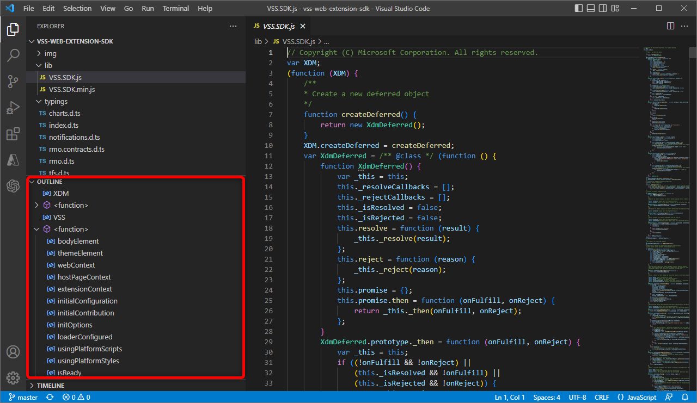
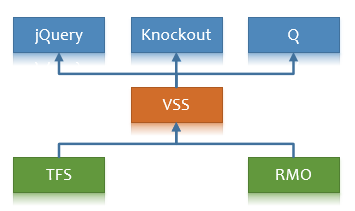

# Background
The VSS Extension Samples in this folder are mainly using the older [vss-web-extension-sdk](https://github.com/microsoft/vss-web-extension-sdk).

But because the [documentation](https://learn.microsoft.com/en-us/azure/devops/extend/overview?toc=%2Fazure%2Fdevops%2Fmarketplace-extensibility%2Ftoc.json&view=azure-devops), I mistakenly used the old SDK with these extensions. I have moved them to this folder for reference.

The new ones to use are:
- [azure-devops-extension-sdk](https://github.com/Microsoft/azure-devops-extension-sdk): Required module for Azure DevOps extensions which allows communication between the host page and the extension iframe.
- [azure-devops-extension-api](https://github.com/Microsoft/azure-devops-extension-api): Contains REST client libraries for the various Azure DevOps feature areas.
- [azure-devops-ui](https://developer.microsoft.com/azure-devops): UI library containing the React components used in the Azure DevOps web UI.

---
# Previous Learning Notes
This document contains learning notes from these extensions It contains:
1. [VSS Extension Samples (that still work)](#vss-extension---samples-that-work-as-of-jan-2023)
2. [VSS Extension - using TypeScript](#vss-extension---using-typescript-instead-of-javascript)
3. [VSS Extension - Understanding the SDK](#vss-extension---understanding-the-sdk)

---
## VSS Extension - samples that work (as of Jan-2023)
There are a lot of extension samples in GitHub that no longer work for various reasons (developed for older versions of Azure DevOps, using old node modules, etc.). This list contains the extension code samples that I was able to deploy.

> **Tip:** In looking for samples, search using the current and previous names of Azure DevOps such as "Visual Studio Team Services" or "VSTS"

1. [**Dashboard Manager**](https://github.com/microsoft/vsts-extension-samples/tree/master/dashboard-manager) by arsaveli

&nbsp;&nbsp;&nbsp;&nbsp;&nbsp;&nbsp;&nbsp;&nbsp;&nbsp;&nbsp;

---
## VSS Extension - using Typescript instead of Javascript
### Problem
The official [tutorial](https://learn.microsoft.com/en-us/azure/devops/extend/overview?toc=%2Fazure%2Fdevops%2Fmarketplace-extensibility%2Ftoc.json&view=azure-devops) use **javascript** while most samples in GitHub like [this](https://github.com/microsoft/vsts-extension-samples) use **typescript** (or **bower**). Even the [extension sdk readme](https://github.com/Microsoft/azure-devops-extension-sdk) straightaway mentions **typescript**. This section describes how it's done.

### Main Point
You may alternatively use **typescript** or **bower** to _compile/generate_ javascript files. Then do as per normal and have your `*.html` refer to the `*.js` output.

### More detailed guidance when using TypeScript
- Install [typescript](https://www.typescripttutorial.net/typescript-tutorial/setup-typescript/)
- Add the VSS extension dependency to `package.json`
```json
"dependencies": {
   ...
   "vss-web-extension-sdk": "^2.109.0"
}
```
- Output the `.js` files to an output directory. Add the following to `compilerOptions` of `tsconfig.json`
```json
"compilerOptions": {
    ...
    "outDir": "dist",
    "types": [
        "vss-web-extension-sdk"
    ]
}
```
- Update the extension manifest to use the output `*.js` files. Add the following to the `files` of the `vss-extension.json` manifest
```json
"files": [
    ...
    {
        "path": "dist",
        "addressable": true,
        "packagePath": "scripts"
    }
]
```
- Update the `*.html` and use the output in the `dist` folder. For example
```html
<script inline src="dist/VSS.SDK.min.js"></script>
```

> **NOTE:** The above concepts can be used for other approaches such as:
> - Using [Bower](https://bower.io/) instead of typescript
> - Compile/output the `*.html` and `*.css` files in addition to the `*.js` files (e.g. React-TypeScript)

---
## VSS Extension - Understanding the SDK
Since the SDK is not well documented, here's my attempt on how to navigate through it.

### Basics
- The main way to know what's available is to download the SDK and navigate using [VSCode](https://code.visualstudio.com)'s Outline View.
    ```bash
    git clone https://github.com/microsoft/vss-web-extension-sdk.git
    ```

&nbsp;&nbsp;&nbsp;&nbsp;&nbsp;&nbsp;&nbsp;&nbsp;&nbsp;&nbsp;

- The SDK is written using [TypeScript](https://www.typescriptlang.org/).

- Understand that VSS extensions are essentially HTML and JavaScript calling various methods in the [Azure DevOps REST API](https://learn.microsoft.com/en-us/rest/api/azure/devops/?view=azure-devops-rest-7.1). The SDK just makes this easier. If what you're trying to achieve is not possible with the REST API, it's probably not possible with the SDK either.

### Tips
- Read the [README](https://github.com/Microsoft/vss-web-extension-sdk#readme), a lot of useful information there. Particularly...
- The type definitions
    - UI controls and client services (see `typings/vss.d.ts`)
    - REST clients and contracts for Build, Work, and Code (see `typings/tfs.d.ts`)
    - REST clients and contracts for Release Management (see `typings/rmo.d.ts`)
- and the Dependency Graph

&nbsp;&nbsp;&nbsp;&nbsp;&nbsp;&nbsp;&nbsp;&nbsp;&nbsp;&nbsp;
- the [README](https://github.com/Microsoft/vss-web-extension-sdk#readme) also shares how you can consume these types using typescript.